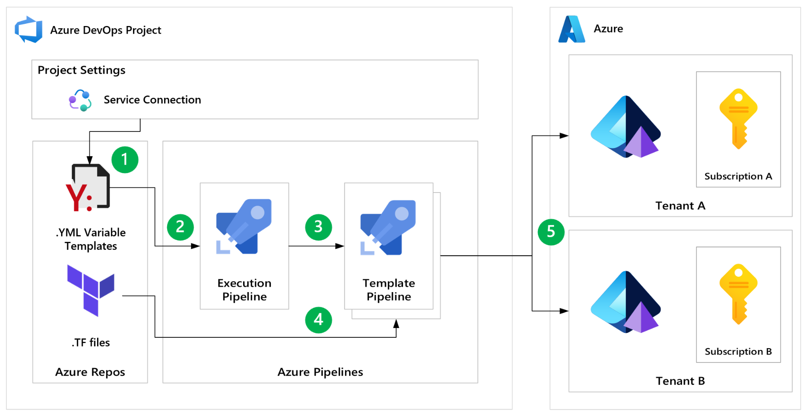

# azure-devops-terraform-multitenant

---

| Page Type | Languages     | Key Services             | Tools     |
| --------- | ------------- | ------------------------ | --------- |
| Sample    | HCL   YAML | Azure DevOps (Pipelines) | Terraform |

---

# Deploying infrastructure across multiple Azure tenants and subscriptions with Azure DevOps and Terraform

Deploying infrastructure as code via Azure Pipelines is a common use case, especially to a single Azure tenant/subscription. However, there are scenarios where you may need to dynamically deploy infrastructure across multiple tenants and subscriptions. There are several limitations that one might experience when trying to configure and execute this scenario; this codebase demonstrates how to circumvent these limitations and dynamically deploy infrastructure to multiple Azure tenants and subscriptions using repeatable workflows.

This codebase provides a simple use case and starting point that should be modified and expanded into more complex scenarios.

## Motivation

- Words about limitations

## Prerequisites

- [An Azure Subscription](https://azure.microsoft.com/en-us/free/) - for hosting cloud infrastructure
- [Azure DevOps](https://azure.microsoft.com/en-us/products/devops/) - for running pipelines
- [Azure CLI (optional on local machine)](https://docs.microsoft.com/en-us/cli/azure/install-azure-cli) - for interacting with Azure and Azure DevOps via the command line
- [Terraform (optional on local machine)](https://www.terraform.io/downloads.html) - for infrastructure as code

## Running this sample

### Configuring Azure DevOps

#### Setting up service connections

- This codebase assumes that for each subscription, [create a service connection in Azure DevOps](https://learn.microsoft.com/en-us/azure/devops/pipelines/library/service-endpoints?view=azure-devops&tabs=yaml). This will allow you to authenticate and deploy resources to that target subscription.

- _Idea for expanded use case_: Service connections can be created at a variety of scopes, including at the management group level, which can be useful for managing multiple subscriptions. While this codebase does not demonstrate this, this is a viable approach but may require additional code changes to the `.azure-pipelines/tf-execution.yml` pipeline.

#### YML Variable configuration files

- Given the above assumption that service connections are created for each subscription, the `.azure-pipelines` directory contains a `serviceConnectionTemplates` directory, which contains a file for each service connection. Each file contains the following:

  - `serviceConnectionName`: The name of the service connection created in Azure DevOps
  - `subscriptionName`: The name of the subscription in Azure (optional, but useful for identifying the subscription in the pipeline logs)
  - `subscriptionId`: The subscription ID in Azure (optional, but useful for identifying the subscription in the pipeline logs)
  - `backendAzureRmResourceGroupName`: The name of the resource group where the Terraform state file will be stored
  - `backendAzureRmStorageAccountName`: The name of the storage account where the Terraform state file will be stored
  - `backendAzureRmContainerName`: The name of the Storage Account container where the Terraform state file will be stored
  - `backendAzureRmKey`: The name of Terraform state file
  - `backendTfRegion`: The Azure region where the storage account will be created

- This codebase provides stubs for two configuration files. These files should be modified to reflect your actual service connection details. Any number of configuration files can be added to this directory, and the [execution pipeline](#execution-pipeline) will dynamically create a matrix of jobs to deploy infrastructure to each subscription.

- _Idea for expanded use case_: You may consider defining a comma-delimited list of subscription IDs in your configuration file mapped to a single service connection. This may eliminate the need to create a service connection file for each subscription. You can then use the [split expression](https://learn.microsoft.com/en-us/azure/devops/pipelines/process/expressions?view=azure-devops#split) to process the array of subscription IDs.

### Pipelines

#### Template Pipeline

- In Azure Pipelines, create a pipeline using the `.azure-pipelines/tf-template.yml` file, and make note of the pipeline ID.

  - You can get the pipeline ID by navigating to the pipeline in Azure DevOps and looking at the URL. The pipeline ID is the number at the end of the URL, e.g.:

    `https://dev.azure.com/<org name>/<project name>/_build?definitionId=<pipeline id>`

  - You can also get the pipeline ID by running the following command with Azure CLI:

    `az pipelines show --organization <your org name> --project <project name> --name <pipeline name>`

- `.azure-pipelines/tf-template.yml` is a pipeline that accepts the name of a configuration file and uses the service connection to deploy infrastructure to the target subscription.
- The steps in the pipeline are as follows:
  1. Using the Azure CLI, perform an idempotent operation to create a resource group, Storage Account, and storage container in the target subscription for remotely storing Terraform state. Read more about this [here](https://learn.microsoft.com/en-us/azure/developer/terraform/store-state-in-azure-storage?tabs=azure-cli).
  2. Print the contents of the configuration file to the pipeline logs for logging purposes.
  3. Install Terraform and execute the commands to initialize, plan, and apply the infrastructure changes using the service connection from the configuration file.

#### Execution Pipeline

- In Azure Pipelines, create a pipeline using the `.azure-pipelines/tf-execution.yml` file.
- `.azure-pipelines/tf-execution.yml` is a pipeline that reads the contents of the `serviceConnectionTemplates` directory and dynamically creates a matrix of jobs to deploy infrastructure to each subscription.
- The steps in the pipeline are as follows:
  1. Read the contents of the `serviceConnectionTemplates` directory and generate a matrix of jobs, one per service connection configuration file.
  2. Execute the template pipeline for each service connection configuration file, passing the filename as a parameter.
- Note that the `infra` directory contains a simple Terraform configuration that creates a resource group. This is a simple example and should be modified to reflect your actual infrastructure requirements.

### Additional notes

#### Parallel execution

- The matrix execution strategy can be [configured to run jobs in parallel](https://learn.microsoft.com/en-us/azure/devops/pipelines/yaml-schema/jobs-job-strategy?view=azure-pipelines#strategy-parallel), which can be useful for speeding up the execution pipeline runtime.
- Additional information about running jobs in parallel can be found [here](https://learn.microsoft.com/en-us/azure/devops/pipelines/licensing/concurrent-jobs?view=azure-devops&tabs=ms-hosted#what-is-a-parallel-job).

#### Why can't I use a single pipeline?

- TODO

## Potential Use Cases

An organization may consider deploying infrastructure across multiple tenants and subscriptions for various reasons, including:

- Multi-tenant solutions
- Enterprise resource segregation
- Regulatory compliance
- Enabling consistent boilerplate deployment stamps across tenants

## Workflow

1. A [configuration file](#configuring-target-tenants-and-subscriptions) is created for each service connection and is stored in the `.azure-pipelines/serviceConnectionTemplates` directory.
2. The [execution pipeline](#execution-pipeline) reads the contents of the `serviceConnectionTemplates` directory and dynamically creates a matrix of jobs to deploy infrastructure to each subscription.
3. A [template pipeline](#template-pipeline) is spun up in the matrix execution strategy, and a configuration filename is passed to the template pipeline as a parameter.
4. The template pipeline reads the configuration file and uses the service connection.
5. The template pipeline uses Terraform to deploy infrastructure to the target subscription using the service connection.

## Additional Resources

- TODO
