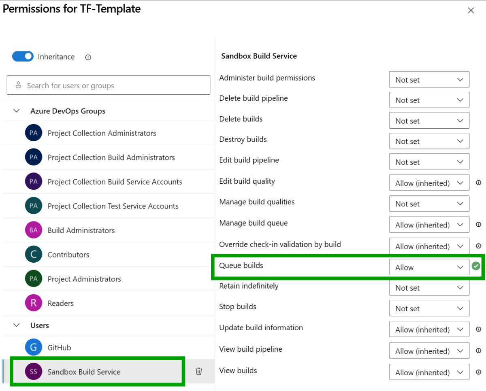

# azure-devops-terraform-multitenant

---

| Page Type | Languages     | Key Services             | Tools     |
| --------- | ------------- | ------------------------ | --------- |
| Sample    | HCL   YAML | Azure DevOps (Pipelines) | Terraform |

---

# Deploying infrastructure across multiple Azure tenants and subscriptions with Azure DevOps and Terraform

Deploying infrastructure as code via Azure Pipelines is a common use case, especially to a single Azure tenant/subscription. However, there are scenarios where you may need to dynamically deploy infrastructure across multiple tenants and subscriptions. There are several limitations that one might experience when trying to configure and execute this scenario; this codebase demonstrates how to circumvent these limitations and dynamically deploy infrastructure to multiple Azure tenants and subscriptions using repeatable workflows.

This codebase provides a simple use case and starting point that should be modified and expanded into more complex scenarios.

## Motivation

Azure Pipelines provides a mechanism to generate copies of a job, each with a different input, effectively allowing for a "looping" construct. This is referred to as a [matrix execution strategy](https://learn.microsoft.com/en-us/azure/devops/pipelines/yaml-schema/jobs-job-strategy?view=azure-pipelines). This is useful for running a repeated set of tasks across different inputs, and it could presumably be used to deploy the same infrastructure as code to multiple tenants and subscriptions; however, the following constraints pose challenges to this approach:

1. The matrix execution strategy can only be used when creating a [job](https://learn.microsoft.com/en-us/azure/devops/pipelines/process/phases?view=azure-devops&tabs=yaml#define-a-single-job).
2. Service connections, which are required to authenticate to Azure, [must be defined prior to runtime and be referred to using template expression syntax](https://learn.microsoft.com/en-us/azure/devops/pipelines/process/variables?view=azure-devops&tabs=yaml%2Cbatch#template-expression-syntax). This is a by-design security measure.
3. Variables can be dynamically loaded from a [template YML file](https://learn.microsoft.com/en-us/azure/devops/pipelines/process/variables?view=azure-devops&tabs=yaml%2Cbatch#specify-variables), and the lowest depth in the [hierarchy](https://techcommunity.microsoft.com/t5/healthcare-and-life-sciences/azure-devops-pipelines-tasks-jobs-stages/ba-p/3694772) they can be defined at is when a job is being invoked.

So, if attempting to use the matrix execution strategy to act as a looping construct that generates a dynamic input (i.e., a service connection), that service connection cannot be used within the matrix job (see #2), nor can a template YML file be loaded containing a service connection, since the logic to load the file would need to occur after job invocation (see #1, #3).

The lack of readily available solutions to this problem was a primary motivator for creating this codebase.

Note that this codebase not only seeks to prove how to deploy infrastructure as code and work around the matrix execution strategy limitations, but also to provide a solution to the general limitation of using service connections dynamically.

## Prerequisites

- [An Azure Subscription](https://azure.microsoft.com/en-us/free/) - for hosting cloud infrastructure
- [Azure DevOps](https://azure.microsoft.com/en-us/products/devops/) - for running pipelines
- [Azure CLI (optional on local machine)](https://docs.microsoft.com/en-us/cli/azure/install-azure-cli) - for interacting with Azure and Azure DevOps via the command line
- [Terraform (optional on local machine)](https://www.terraform.io/downloads.html) - for infrastructure as code

## Running this sample

### Configuring Azure DevOps

#### Setting up service connections

- This codebase assumes that for each subscription, a [service connection is created in Azure DevOps](https://learn.microsoft.com/en-us/azure/devops/pipelines/library/service-endpoints?view=azure-devops&tabs=yaml). This will allow you to authenticate and deploy resources to that target subscription.

- _Idea for expanded use case_: Service connections can be created at a variety of scopes, including at the [management group level](https://learn.microsoft.com/en-us/azure/devops/pipelines/library/connect-to-azure?view=azure-devops#create-an-azure-resource-manager-service-connection-that-uses-a-service-principal-secret), which can be useful for managing multiple subscriptions at once. While this codebase does not demonstrate this, this is a viable approach but may require additional code changes to the `.azure-pipelines/tf-execution.yml` pipeline.

#### YML Variable configuration files

- Given the above assumption that service connections are created for each subscription and the capability described in point #3 of the [motivation section](#motivation), the `.azure-pipelines` directory contains a `serviceConnectionTemplates` directory, which contains a file for each service connection. Each file contains the following:

  - `serviceConnectionName`: The name of the service connection created in Azure DevOps
  - `subscriptionName`: The name of the subscription in Azure (optional, but useful for identifying the subscription in the pipeline logs)
  - `subscriptionId`: The subscription ID in Azure (optional, but useful for identifying the subscription in the pipeline logs)
  - `backendAzureRmResourceGroupName`: The name of the resource group where the Terraform state file will be stored
  - `backendAzureRmStorageAccountName`: The name of the storage account where the Terraform state file will be stored
  - `backendAzureRmContainerName`: The name of the Storage Account container where the Terraform state file will be stored
  - `backendAzureRmKey`: The name of Terraform state file
  - `backendTfRegion`: The Azure region where the storage account will be created

- These files provide a mechanism for defining variables before runtime (point #2 of the [motivation section](#motivation)), and will be dynamically loaded using the approach described in latter sections of this document.

- This codebase provides stubs for two configuration files. These files should be modified to reflect your actual service connection details. Any number of configuration files can be added to this directory, and the [execution pipeline](#execution-parent-pipeline) (described in a below section) will dynamically create a matrix of jobs to deploy infrastructure to each subscription.

- _Idea for expanded use case_: You may consider defining a comma-delimited list of subscription IDs in your service connection configuration file as a variable. This may eliminate the need to create a service connection file for each subscription. You can then use the [split expression](https://learn.microsoft.com/en-us/azure/devops/pipelines/process/expressions?view=azure-devops#split) to process the array of subscription IDs.

- _Another idea for expanded use case_: If you have a large number of of service connections to manage, you may consider using the Azure DevOps REST API to [create](https://learn.microsoft.com/en-us/rest/api/azure/devops/serviceendpoint/endpoints/create?view=azure-devops-rest-7.1&tabs=HTTP) and/or [read](https://learn.microsoft.com/en-us/rest/api/azure/devops/serviceendpoint/endpoints/get?view=azure-devops-rest-7.1&tabs=HTTP) service connections, coupled with a programmatic approach to generating the YML configuration files.

### Pipelines

#### Template (Child) Pipeline

- In Azure Pipelines, [create a pipeline](https://learn.microsoft.com/en-us/azure/devops/pipelines/create-first-pipeline?view=azure-devops&tabs=java%2Ctfs-2018-2%2Cbrowser#create-your-first-pipeline-1) using the `.azure-pipelines/tf-template.yml` file, and make note of the pipeline ID.

  - You can get the pipeline ID by navigating to the pipeline in Azure DevOps and looking at the URL. The pipeline ID is the number at the end of the URL, e.g.:

    `https://dev.azure.com/<org name>/<project name>/_build?definitionId=<pipeline id>`

  - You can also get the pipeline ID by running the following command with Azure CLI:

    `az pipelines show --organization <your org name> --project <project name> --name <pipeline name>`

- `.azure-pipelines/tf-template.yml` is a pipeline that accepts the name of a configuration file and uses the service connection to deploy infrastructure to the target subscription.
- The steps in the pipeline are as follows:
  1. (Optional step) Using the Azure CLI, perform a set of idempotent operations to create a resource group, Storage Account, and storage container in the target subscription for remotely storing Terraform state. Read more about this [here](https://learn.microsoft.com/en-us/azure/developer/terraform/store-state-in-azure-storage?tabs=azure-cli).
  2. Print the contents of the configuration file to the pipeline logs for logging purposes.
  3. Install Terraform and execute the commands to initialize, plan, and apply the infrastructure changes using the service connection from the configuration file.

#### Execution (Parent) Pipeline

- In Azure Pipelines, create a pipeline using the `.azure-pipelines/tf-execution.yml` file.
- `.azure-pipelines/tf-execution.yml` is a pipeline that reads the contents of the `serviceConnectionTemplates` directory and dynamically creates a matrix of jobs to deploy infrastructure to each subscription.
- You need to update the `pipelineId` variable with the ID of the template pipeline created in the previous step.
- The steps in the pipeline are as follows:
  1. Read the contents of the `serviceConnectionTemplates` directory and generate a matrix of jobs, one per service connection configuration file.
  2. Execute the template pipeline for each service connection configuration file, passing the filename as a parameter.
- Note that the `infra` directory contains a simple Terraform configuration. This is a contrived example and should be modified to reflect your actual infrastructure requirements.
- Note that you will need to enable the [Queue builds permission](https://learn.microsoft.com/en-us/azure/devops/pipelines/policies/permissions?view=azure-devops) on the template pipeline to allow the execution pipeline to trigger the template pipeline:  
  

### Additional notes

#### Parallel execution

- The matrix execution strategy can be [configured to run jobs in parallel](https://learn.microsoft.com/en-us/azure/devops/pipelines/yaml-schema/jobs-job-strategy?view=azure-pipelines#strategy-parallel), which can be useful for speeding up the execution pipeline runtime.
- Additional information about running jobs in parallel can be found [here](https://learn.microsoft.com/en-us/azure/devops/pipelines/licensing/concurrent-jobs?view=azure-devops&tabs=ms-hosted#what-is-a-parallel-job).

## Workflow

1. A [configuration file](#setting-up-service-connections) needs to be created for each service connection and stored in the `.azure-pipelines/serviceConnectionTemplates` directory.
2. The [execution pipeline](#execution-parent-pipeline) reads the contents of the `serviceConnectionTemplates` directory and dynamically creates a matrix of jobs to deploy infrastructure to each subscription.
3. A [template pipeline](#template-child-pipeline) is spun up in the matrix job, and a configuration filename is passed to the template pipeline as a parameter.
4. The template pipeline reads the configuration file using the parameter value, uses the service connection within to authenticate with Azure, and uses the Terraform files to initialize and plan the infrastructure deployment.
5. The template pipeline uses Terraform to deploy infrastructure to the target subscription using the service connection.

## Potential Use Cases

An organization may consider deploying the same infrastructure across multiple tenants and subscriptions for various reasons, including:

- Multi-tenant solutions
- Enterprise resource segregation
- Regulatory compliance
- Deploying consistent boilerplate deployment stamps across tenants

## Additional Resources

- [Programmatically creating YML files with Python (blog)](https://python.land/data-processing/python-yaml#Writing_or_dumping_YAML_to_a_file)
